## Table of Contents

* Table of Contents
{:toc}

## Introduction

Are you a university student looking to score a holiday internship? Do you feel overwhelmed by all the application details you have to keep track of? Have you missed any application deadlines because there are just too many to remember? Have you ever wished that there were a comprehensive app that could help you track your entire internship application process? If you answered yes to any of these questions, we have just the application for you!

InternSHIP is a **desktop app for university students to manage their internship application deadlines.** Here are its main features:
* Tracking all essential internship application details (e.g. submission deadlines, interview date and time, completion status, etc...)
* Viewing specific applications

Now you will never miss any internship application deadlines or interviews again!

InternSHIP has been optimized for use via a Command Line Interface (CLI) while still having the benefits of a Graphical User Interface (GUI). If you can type fast, InternSHIP can get your internship management tasks done faster than traditional GUI apps.

We hope you find InternSHIP to be very useful in your internship hunt!

--------------------------------------------------------------------------------------------------------------------

## Information about this User Guide

This section aims to provide some information on the purpose as well as target audience of our User Guide.

### Purpose

This guide aims to:
* Teach first-time users how to [start using InternSHIP](#quick-start).
* Show users [how to use each command in detail](#features) should they encounter any difficulty using any of the commands in InternSHIP.
* Answer some commonly asked questions in the [FAQ](#faq) section.
* Provide experienced users with [tips](#tips-bulb) on how to further improve their experience using InternSHIP.
* Provide existing users with a comprehensive summary of all the [commands](#command-summary) they can use in InternSHIP and the [prefixes](#prefix-summary) used in these commands.
* Show any interested party (e.g. other developers) the [references](#acknowledgements) used in the creation of InternSHIP.

### Target Audience

As the target audience of InternSHIP is university students, this User Guide is mainly targeted towards the same demographic. This guide is therefore aimed at users who:
* Are familiar with navigating around a webpage using hyperlinks.
* Are comfortable downloading and installing software on their computer.
* Are able to type fast and are comfortable using a CLI.  
This User Guide **does not assume that the reader has a technical background**. Therefore, university students of all majors should be able to use this guide. The definitions for certain technical terms can be found in the [glossary](#glossary).

## How to use this User Guide

This section aims to explain how to properly utilise our User Guide.

### How to navigate this document
This document is separated into different sections:
1. [Quick Start](#quick-start): Download, install and start using InternSHIP as a first-time user.
2. [Features](#features): Find detailed information about how to use each command in InternSHIP.
3. [FAQ](#faq): Find answers to some commonly-asked questions.
4. [Tips](#tips-bulb): View tips on how to enhance your experience with InternSHIP.
5. [Command Summary](#command-summary): View a summary list of all the commands supported by InternSHIP.
6. [Prefix Summary](#prefix-summary): View a summary list of all the prefixes for the different fields used in InternSHIP commands.
7. [Glossary](#glossary): Find the definitions of terms used in this User Guide.
8. [Acknowledgements](#acknowledgements): Find the references used in the creation of InternSHIP.
For a more detailed overview, refer to this [Table of Contents](#table-of-contents) at the start of our User Guide.

### Special formats

Below are some special formats used throughout this User Guide:

**Information boxes**

 :information_source: **Info:** Information boxes provide extra information that might be useful!

**Tips**

 :bulb: **Tip:** Tips are pointers that can help to improve your experience using InternSHIP!

**Warnings**

 :warning: **Warning:** Warnings are **very important** messages to take note of to avoid any unintended consequences of a command!!

**Highlights**

`Highlights are used to emphasise special text such as parameters, field values, commands, file names or any user inputs.`

### Navigating the GUI
TO BE DONE AFTER WE FINALISE THE UI!!

### Command format

All the commands in the [Features](#features) section adhere to the following rules:

* Words in `UPPER_CASE` are the parameters to be supplied by the user. 
  e.g. if the User Guide states `add COMPANY_NAME`, users can input `add Shopee`, or any other company name.

 :bulb: **Tip:** Go to our [glossary](#glossary) and [parameters](#parameters) sections to find out more about parameters!

* Items in square brackets are optional.  
  e.g `c/COMPANY_NAME [r/REQUIREMENT]` can be used as `c/Shopee r/CV` or as `c/Shopee`.

* Items with `…​` after them can be used multiple times including zero times.  
  e.g. `[r/REQUIREMENT]…​` can be used as `r/` (0 time), `r/CV` (1 time), `r/CV r/Resume` (2 times) etc.

* Parameters can be in any order. 
  e.g. if the command specifies `c/COMPANY_NAME p/INTERNSHIP_POSITION`, `p/INTERNSHIP_POSITION c/COMPANY_NAME`
  is also acceptable.

* If a parameter is expected only once in the command but you specified it multiple times, only the last occurrence of the parameter will be taken. 
  e.g. if you specify `c/Grab c/Shopee`, only `c/Shopee` will be taken.

* For parameters that can be specified any number of times(`APPLICATION_REQUIREMENTS` and `INTERVIEW_DATE_AND_TIME`), if the same values are specified multiple times, only one instance will be taken. 
  e.g. if you specify `r/CV r/CV r/CV`, only `r/CV` will be taken.

* For commands that do not require any parameters (such as `list` and `clear`), any parameters input by the user will be ignored. 
  e.g. `list 123` will be interpreted as just `list`.

### Parameters

Here is a summary of all the parameters used in InternSHIP commands:

Parameter | Refers to | Required format | Application field? | Notes
--------|-------|-------|----|-----
**APPLICATION_DEADLINE** | The deadline for the application submission. | It should be a valid date in `YYYY-MM-DD` format. | Yes
**APPLICATION_PRIORITY** | The user-set priority of the application. | It can only take 3 values: high, medium or low. | Yes
**APPLICATION_REQUIREMENTS** | The required deliverables for the application submission. | It can take any value. | Yes | e.g. CV, portfolio...
**APPLICATION_OUTCOME** | The outcome of the application (also called application status). This is the company's decision on whether the candidate has been accepted or rejected. | It can only take 3 values: Pending, Accepted or Rejected. | Yes | This is **up to the company, not the user**.
**COMPANY_NAME** | The name of the company the application was made to. | It should only contain [alphanumeric](#glossary) characters and spaces, and should not be blank. | Yes
**COMPLETION_STATUS** | Whether or not the application has been submitted by the user. | It can only take 2 values: completed or uncompleted. | Yes | Unlike the APPLICATION_OUTCOME, this is **up to the user, not the company**.
**DAYS** | The number of days from today. | It must be a **non-negative integer** 0, 1, 2, ... | No
**FIELD** | Any one of the application fields. | It should be in its prefix form, as shown in the [prefix summary](#prefix-summary). | No
**INDEX** | The index number of the application as shown in the **currently displayed application list**. | It must be a **positive integer** 1, 2, 3, ... | No
**INTERNSHIP_POSITION** | The job applied for in the application. | It should only contain alphanumeric characters and spaces, and should not be blank. | Yes
**INTERVIEW_DATE_AND_TIME** | The date and time of the interview(s) required for an application. | It should be a valid date and time in `YYYY-MM-DD HHmm` format. The date and time are separated by a space, and the time is represented in a 24-hour system. | Yes

--------------------------------------------------------------------------------------------------------------------

## Quick start

1. Ensure you have Java `11` or above installed in your Computer.

2. Download the latest `InternSHIP.jar` from [here](https://github.com/AY2122S1-CS2103T-W17-1/tp/releases).

3. Copy the file to the folder you want to use as the _home folder_ for your InternSHIP app.

4. Double-click the file to start the app. 
   
 :bulb: **Tip:** If double-clicking does not work for you, try to open the app via terminal. To do so, open the terminal, key in `java -jar InternSHIP.jar` and press `Enter`.

5. A GUI similar to the one shown below should appear in a few seconds. 
   Note how the app contains some sample data. 
    
   

 :bulb: **Tip:** Use the [`clear`](#clearing-all-entries--clear) command to erase all the sample data when you no longer need them. 

6. Type the command in the command box and press Enter to execute it.  
   Some example commands you can try:
    
    * **`help`** : Opens up the `Help` Window.
    * **`list`** : Lists all the entries in the internship list.

    * **`add c/shopee p/software engineer d/2021-12-12`**: 
   Adds a company `shopee` with the position `software engineer` at deadline `2021-12-12` to the application list.

    * **`delete 3`** : Deletes the 3rd entry in the application list.

    * **`clear`** : Deletes all the application entries.

    * **`exit`** : Exits the app.

7. Refer to the [Features](#features) below for details of each command.

--------------------------------------------------------------------------------------------------------------------

## Features

This section shows all of InternSHIP's supported commands and how they should be used.

The commands are split in terms of InternSHIP's main features:
* [Tracking application details](#tracking-application-details)
* [Viewing specific applications](#viewing-specific-applications)
* [Others](#others)

 :bulb: **Tip:** To make the best use of this section, make sure to familiarise yourself with the [command format rules](#command-format) and [parameters](#parameters) used!

### Tracking application details

#### Adding an application : `add`

Adds a new entry to the application list in InternSHIP.  

 
:information_source: **Info:**  
Minimally, the following fields are required when a new entry is added:  
- `COMPANY_NAME`  
- `INTERNSHIP_POSITION`  
- `APPLICATION_DEADLINE`  
 
There are three fields that receive their default values.  
These fields can be changed later using the `edit`, `complete` or `accept/reject` commands respectively.  
- `APPLICATION_PRIORITY`: set as `Medium`  
- `COMPLETION_STATUS`  set as `Uncompleted`  
- `APPLICATION_OUTCOME` (i.e., application status) set as `Pending`  
 
Additionally, `APPLICATION_REQUIREMENTS`, and `INTERVIEW_DATE_AND_TIME` are optional fields that can either be specified or not.  
If not specified at this stage, it can still be added and edited later using the `edit` command. 
 
The `APPLICATION_DEADLINE` must be entered in the `YYYY-MM-DD` format. The `INTERVIEW_DATE_AND_TIME` must be entered in the
`YYYY-MM-DD HHmm` format.
 
Adding an application entry with the same `COMPANY_NAME` and `INTERNSHIP_POSITION`  as an existing entry is not allowed. 

Format:
`add c/COMPANY_NAME p/INTERNSHIP_POSITION d/APPLICATION_DEADLINE [r/APPLICATION_REQUIREMENTS]…​ [i/INTERVIEW_DATE_AND_TIME]…​`

* Adds a new application with the specified field values to the list.

 :bulb: **Tip:** You can input more than one `INTERVIEW_DATE_AND_TIME` since many companies have multiple rounds of interviews for a single application!

Examples:
* `add c/Shopee p/software engineer d/2021-12-12` adds a new internship application to `Shopee` as a `software engineer`, with the application deadline `12 December 2021`.
* `add c/Shopee p/software engineer d/2021-12-12 r/resume` adds a new internship application with the same details as the previous example, but with an additional application requirement of a `resume`.
* `add c/Shopee p/software engineer d/2021-12-12 r/resume i/2021-12-18 1030` adds a new internship application with the same details as the previous example, but with an interview on `18 Dec 2021 10:30`.

> Before the command `add c/Shopee p/software engineer d/2021-12-12`
 
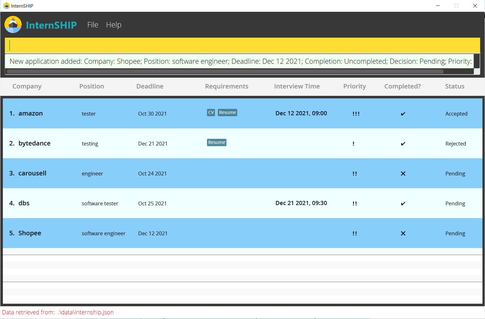
> After the command `add c/Shopee p/software engineer d/2021-12-12`

#### Editing the details of an existing entry : `edit`

Edits the fields of a specified existing entry in the application list.

 
:information_source: **Info:**  
The fields that can be edited using this command are:  
- `COMPANY_NAME`  
- `INTERNSHIP_POSITION`  
- `APPLICATION_DEADLINE`  
- `APPLICATION_PRIORITY`  
- `APPLICATION_REQUIREMENTS`  
- `INTERVIEW_DATE_AND_TIME`  
Editing any field is optional, but least one field must be edited each time.  
Multiple fields can be edited at the same time. 
 
For the edited fields, existing values will be overwritten and updated to the new input values. The values for the rest of the fields will remain the same.
 
Editing an application entry such that the `COMPANY_NAME` and `INTERNSHIP_POSITION` become the same as an existing entry is not allowed. 
 
 
For the `INTERVIEW_DATE_AND_TIME` and `APPLICATION_REQUIREMENTS` fields, to edit one particular entry of the respective field,
values for all other entries must be copied over too. 
 
 
For example, consider an application entry with index 9 
that currently has `2021-12-12 0800` and 
`2021-12-13 0900` for the `INTERVIEW_DATE_AND_TIME`,
and `CV` and `Resume` for the `APPLICATION_REQUIREMENTS`:
 
- To edit the first `INTERVIEW_DATE_AND_TIME` i.e. `2021-12-12 0800`, this is the command that should be used:
 
`edit 9 i/2021-10-08 0700 i/2021-12-13 0900`
 
So here the input for the first value of `INTERVIEW_DATE_AND_TIME` is changed to the desired value, but the second value is entered unchanged.
 
- To edit the first `APPLICATION_REQUIREMENTS` i.e. `CV`, this is the command that should be used:
 
`edit 9 r/Coding Challenge i/Resume`
 
So here the input for the first value of `APPLICATION_REQUIREMENTS` is changed to the desired value, but the second value is entered unchanged.

 :bulb: **Tip:**  
For the optional fields `APPLICATION_REQUIREMENTS` and `INTERVIEW_DATE_AND_TIME`, you can remove all the requirements or interview date and times by using `edit r/` or `edit i/` respectively without specifying anything after the prefix.

Format: `edit INDEX [c/COMPANY_NAME] [p/INTERNSHIP_POSITION] [d/APPLICATION_DEADLINE] [pr/APPLICATION_PRIORITY] [r/APPLICATION_REQUIREMENTS] [i/INTERVIEW_DATE_AND_TIME]`

* Edits the application at the specified `INDEX`.

Examples:
* `edit 1 c/Grab d/2021-12-20` changes the company name and deadline of the 1st application to `Grab` and `2021-12-20` respectively.
* `edit 2 p/UI designer` changes the internship position of the 2nd application to `UI designer`.

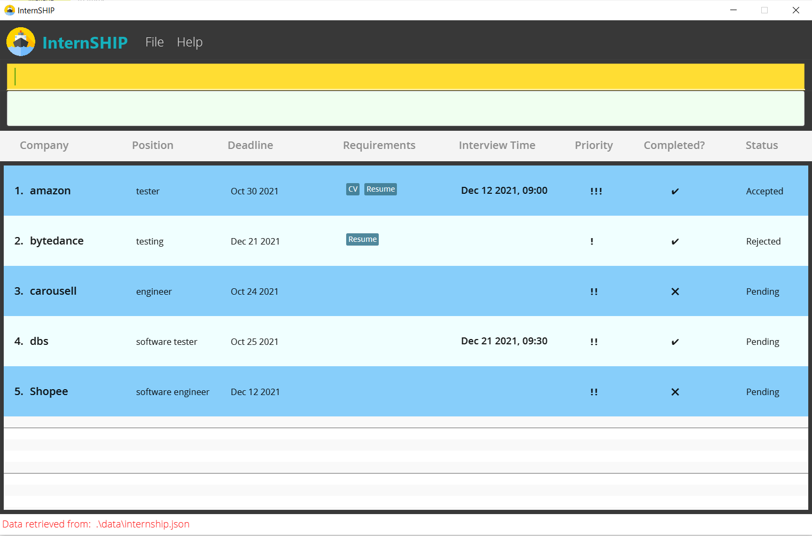
> Before the command `edit 1 c/Grab d/2021-12-20`

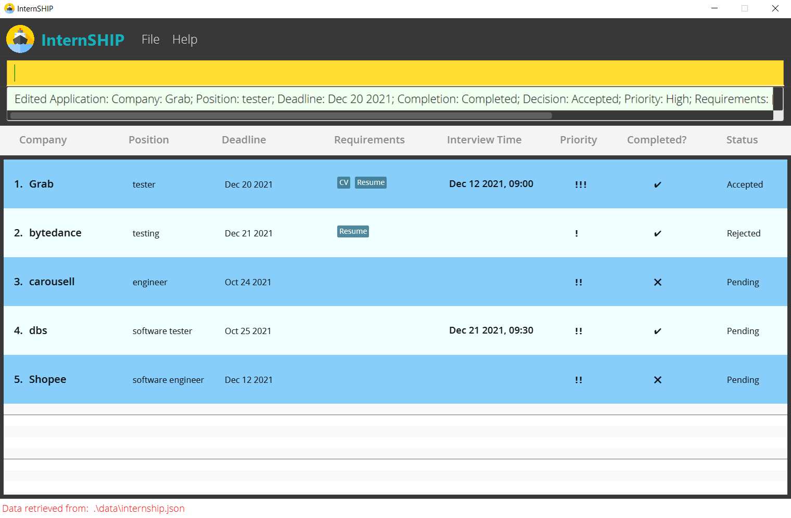
> After the command `edit 1 c/Grab d/2021-12-20`

#### Completing an application : `complete`

Marks the specified entry in the application list as completed, meaning the user has completed the application for that internship.

Format: `complete INDEX`

* Marks the entry at the specified `INDEX` as completed.

Examples:
* `complete 3` marks the 3rd entry in the application list as completed.

> Before the command `complete 3`

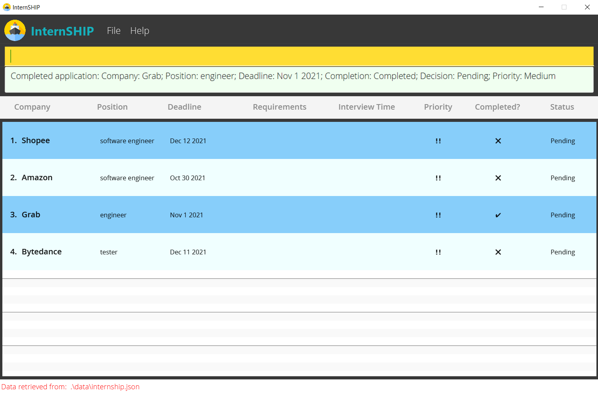
> After the command `complete 3`

#### Updating the application outcome to 'Accepted': `accept`

Updates the application outcome (status) of an application to **'Accepted'**.

 
:information_source: **Info:**  
The application outcome is the **decision/outcome provided by the company** on whether the candidate has been `Accepted` or not for the role.  
It is different from the 'Completion Status', which represents whether the user has completed submitting the application (and all related requirements) or not.  
 
When a new application is added, the outcome is `Pending` by default as it is assumed that the user has not received the decision from the company yet. The outcome can later be changed to `Accepted` using the `accept` command. 
 
The `accept` command also automatically marks the application entry at the specified index as 'Completed', because it is assumed
that if the user has already received the application outcome, then they must have completed and submitted the application.

Format: `accept INDEX`

- Marks the entry at the specified `INDEX` as 'Accepted'.
- The index refers to the index number shown in the currently displayed application list.
- The index must be a **positive integer** 1, 2, 3, …​

Examples:
* `accept 1` marks the first entry as 'Accepted'.
* `accept 4` marks the fourth entry as 'Accepted'.

> Before the command `accept 4`

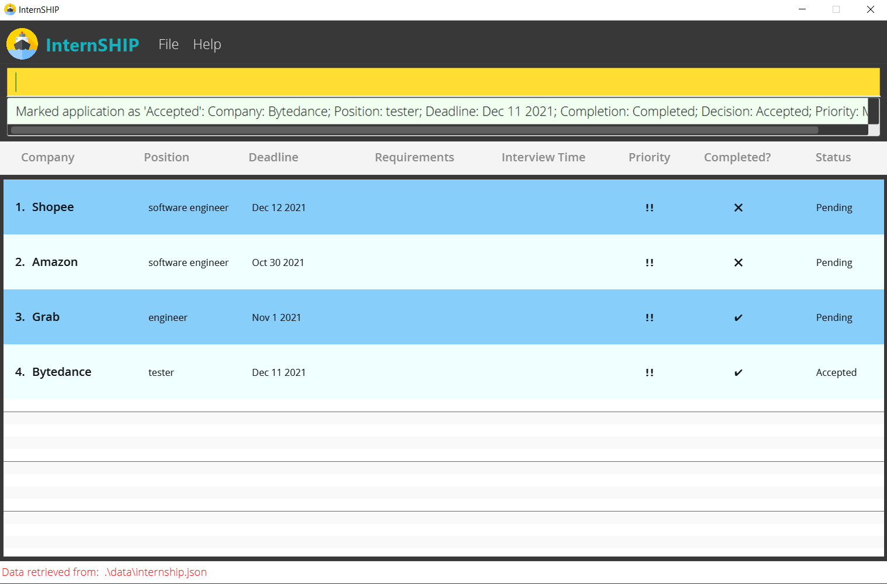
> After the command `accept 4`

#### Updating the application outcome to 'Rejected': `reject`

Updates the application outcome (status) of an application to **'Rejected'**.

 
:information_source: **Info:**  
The application outcome is the **decision/outcome provided by the company** on whether the candidate has been `Rejected` or not for the role.  
It is different from the 'Completion Status', which represents whether the user has completed submitting the application (and all related requirements) or not.  
 
When a new application is added, the outcome is `Pending` by default as it is assumed that the user has not received the decision from the company yet. The outcome can later be changed to `Rejected` using the `reject` command.
 
The `reject` command also automatically marks the application entry at the specified index as 'Completed', because it is assumed
that if the user has already received the application outcome, then they must have completed and submitted the application.

Format: `reject INDEX`

- Marks the entry at the specified `INDEX` as 'Rejected'.
- The index refers to the index number shown in the currently displayed application list.
- The index must be a **positive integer** 1, 2, 3, …​

Examples:
* `reject 1` marks the first entry as 'Rejected'.
* `reject 3` marks the third entry as 'Rejected'.

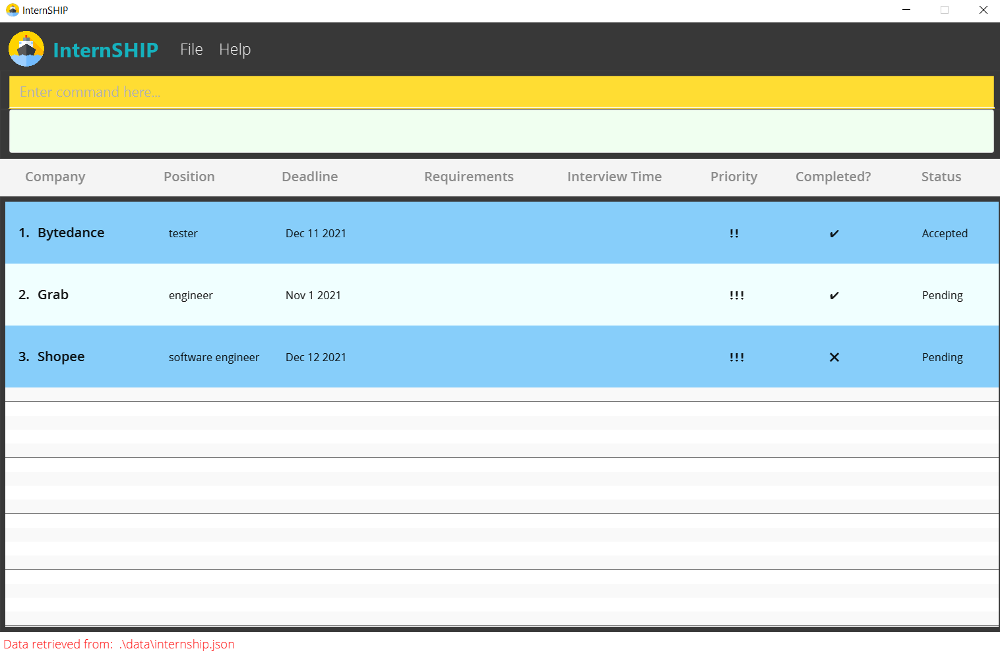
> Before the command `reject 3`

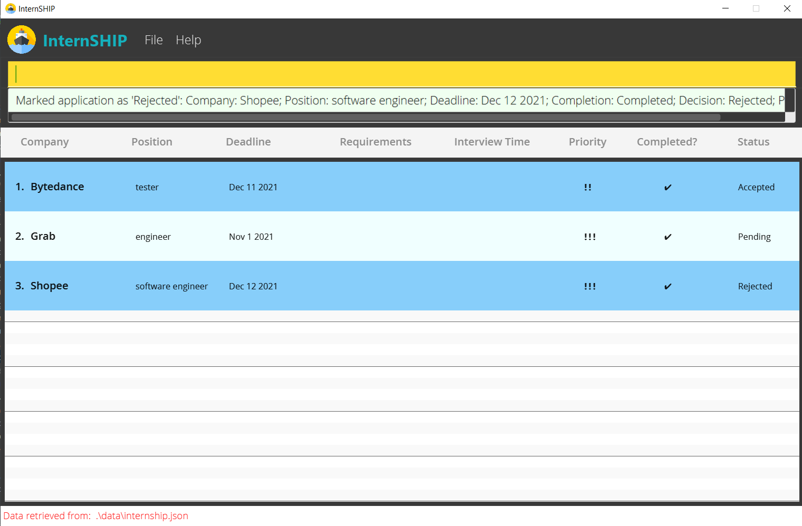
> After the command `reject 3`

### Viewing specific applications

#### Listing upcoming deadlines : `soon`

Shows all the applications that are close to the submission deadlines or interview time within a specified number of days.

 :bulb: **Tip:** `soon` will only show applications that are not completed yet!

 
:information_source: **Info:**  
The available fields are:  
- APPLICATION_DEADLINE `d/`   
- INTERVIEW_DATE_AND_TIME `i/`

Format: `soon FIELD DAYS`

* Find applications that are within `DAYS` days.
* The number of days must be a **positive integer** 0, 1, 2, …​ 
* The number must not be more than the maximum integer value (i.e 2147483647). 
* Other values will be considered invalid.
* Only one field and one keyword can be provided each time.

Examples:

* `soon d/5` shows applications whose submission deadlines are within 5 days from today's date.

> Before the command `soon d/5`

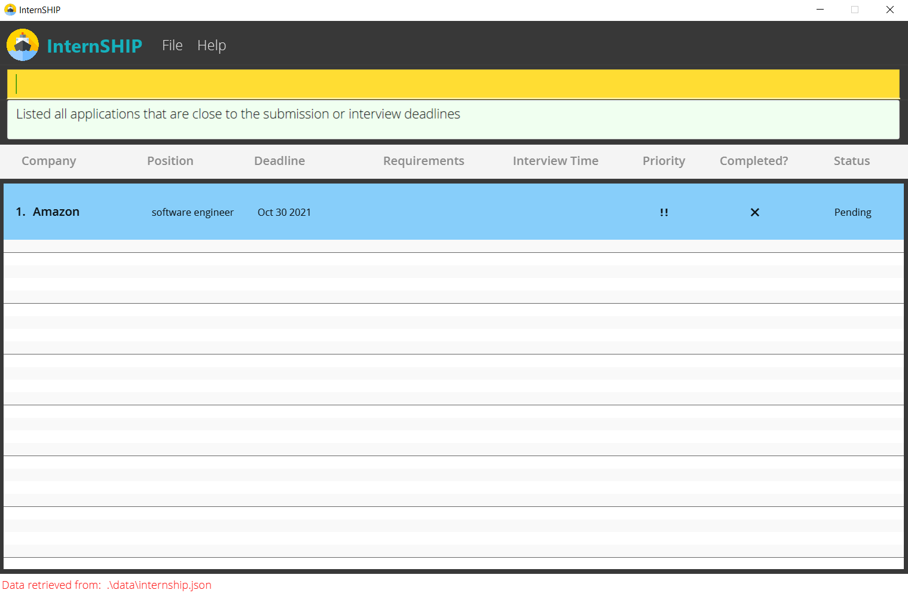
> After the command `soon d/5`
 

#### Finding entries by keyword : `find`

 :warning: **Warning:** This command will display a filtered list. If you want to go back and view the full list of applications in InternSHIP, use the `list` command (explained below) after this command instead of the `undo` command!

Finds application(s) from the application list.

 :bulb: **Tip:** Only one field and its corresponding keyword can be provided each time!

Format: `find FIELD keyword`

* Finds all application(s) from the application list that match the keyword in the given field.

:information_source: **Info:**  
The fields available to be found are:  
- COMPANY_NAME `c/`  
- INTERNSHIP_POSITION `p/`  
- COMPLETION_STATUS `c1/`  
- APPLICATION_OUTCOME (i.e. STATUS) `s/`  
- APPLICATION_PRIORITY `pr/`  
- APPLICATION_REQUIREMENTS `r/`  

Format of the keyword after each field should follow the required format in the Parameter Summary.

For completion_status, application_outcome and application_priority, exactly one case-insensitive keyword is expected.

Examples:
* `find c/Grab` shows all the applications whose company name is Grab.
* `find p/software engineer` shows all the applications whose position is software engineer.
* `find c1/Completed` shows all the applications that are completed.
* `find s/Accepted` shows all the applications whose application outcome is Accepted.  
* `find pr/High` shows all the applications whose priority is High.
* `find r/cv` shows all the applications that include cv as a requirement.

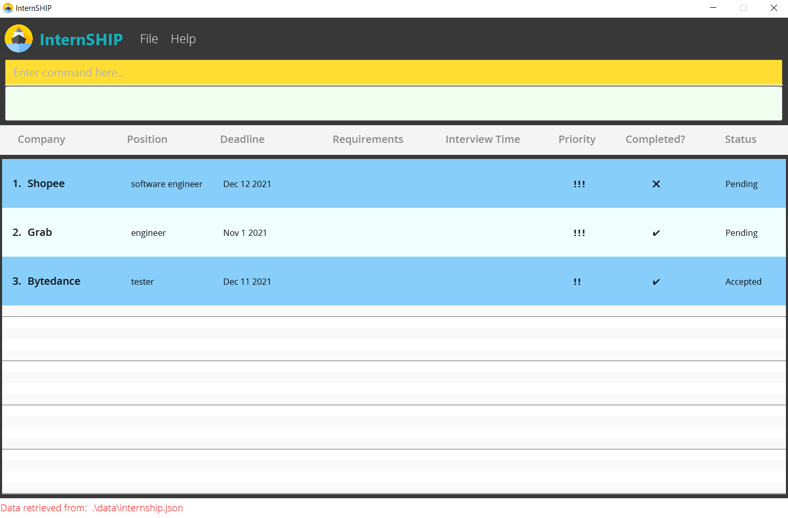
> Before the command `find pr/High`

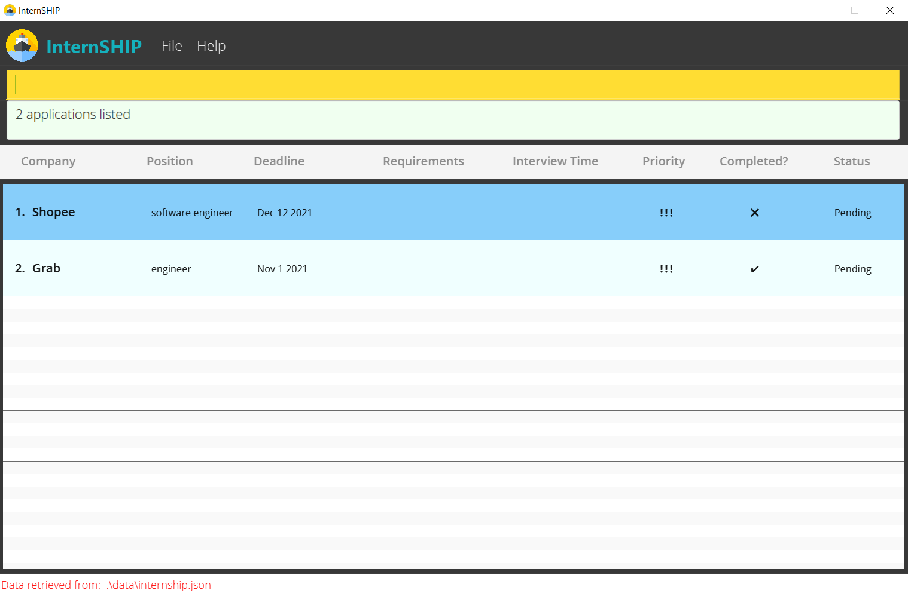
> After the command `find pr/High`

#### Listing all entries : `list`

Shows a list of all the entries in the application list in InternSHIP.

Format: `list`

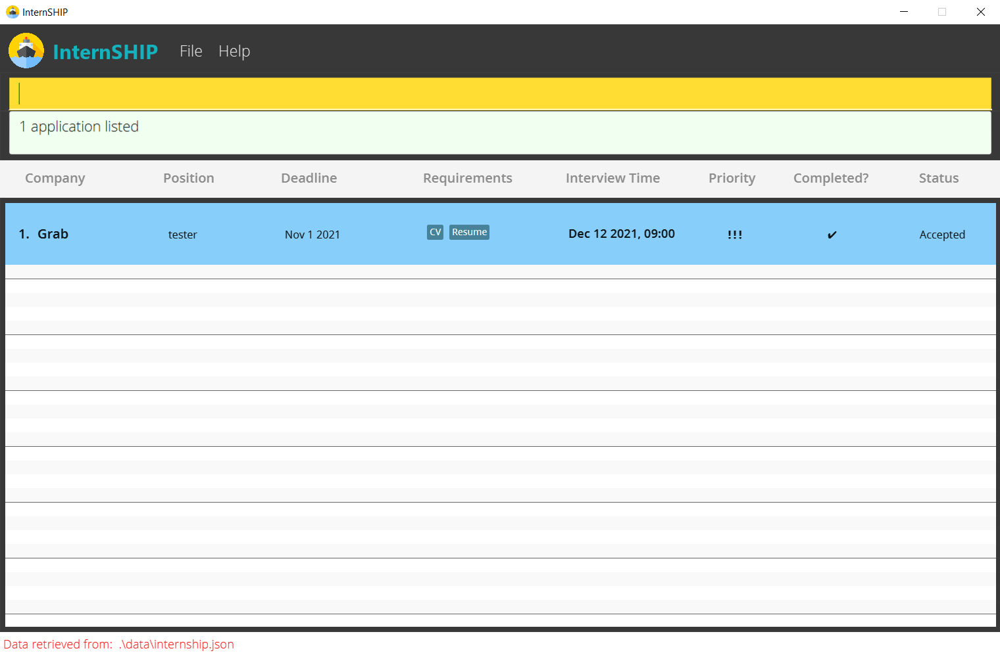
> Before the command `list` (assume the previous command results in only partial list being displayed)

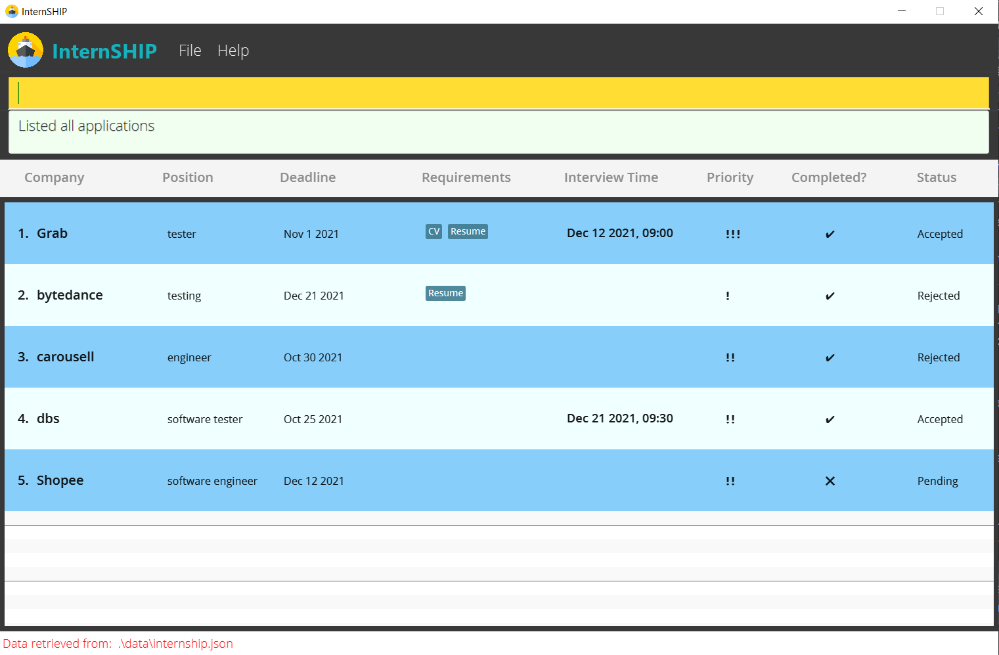
> After the command `list` (full application list is displayed)
> 

#### Sorting the entries : `sort`

 :warning: **Warning:** The `undo` command cannot undo list sorting!

Sorts all entries in the **currently displayed** application list by a specified field.

 
:information_source: **Info:**  
The fields available to sort by are:  
- COMPANY_NAME `c/` (ascending alphabetical order)  
- INTERNSHIP_POSITION `p/` (ascending alphabetical order)  
- APPLICATION_DEADLINE `d/` (sooner to later deadline)  
- INTERVIEW_DATE_AND_TIME `i/` (sooner to later interview)  
- APPLICATION_PRIORITY `pr/` (higher to lower priority)

Format: `sort FIELD`

* Sorts the application list by `FIELD`.

Examples:
* `sort c/` shows all the applications saved in the current InternSHIP sorted by company name, in alphabetical order.

> Before the command `sort c/`

> After the command `sort c/`
> 

### Others

#### Deleting an entry : `delete`

Deletes the specified entry from the application list.

Format: `delete INDEX`

* Deletes the entry at the specified `INDEX`.

Examples:
* `delete 2` deletes the 2nd entry in the main application list.

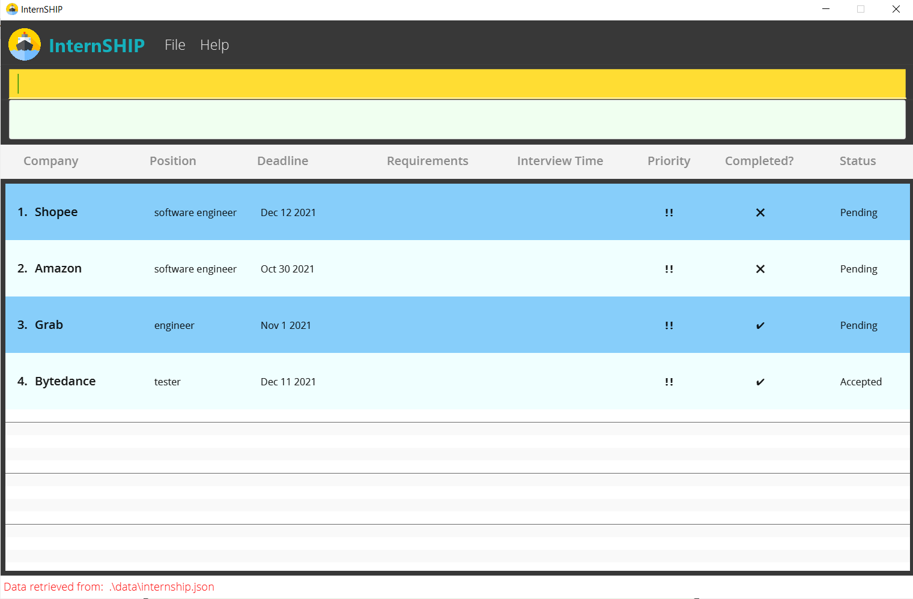
> Before the command `delete 2`

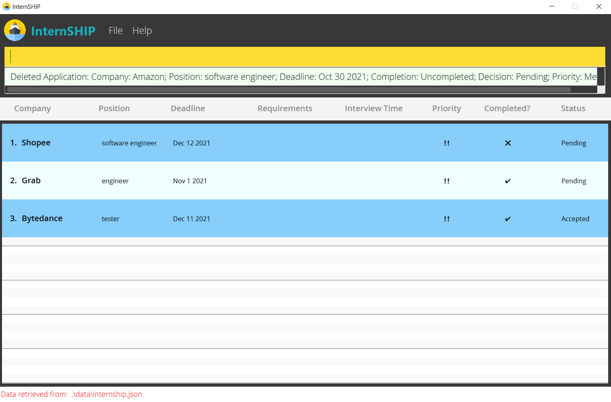
> After the command `delete 2`

#### Clearing all entries : `clear`

Clears all entries from InternSHIP.

Format: `clear`

> Before the command `clear`

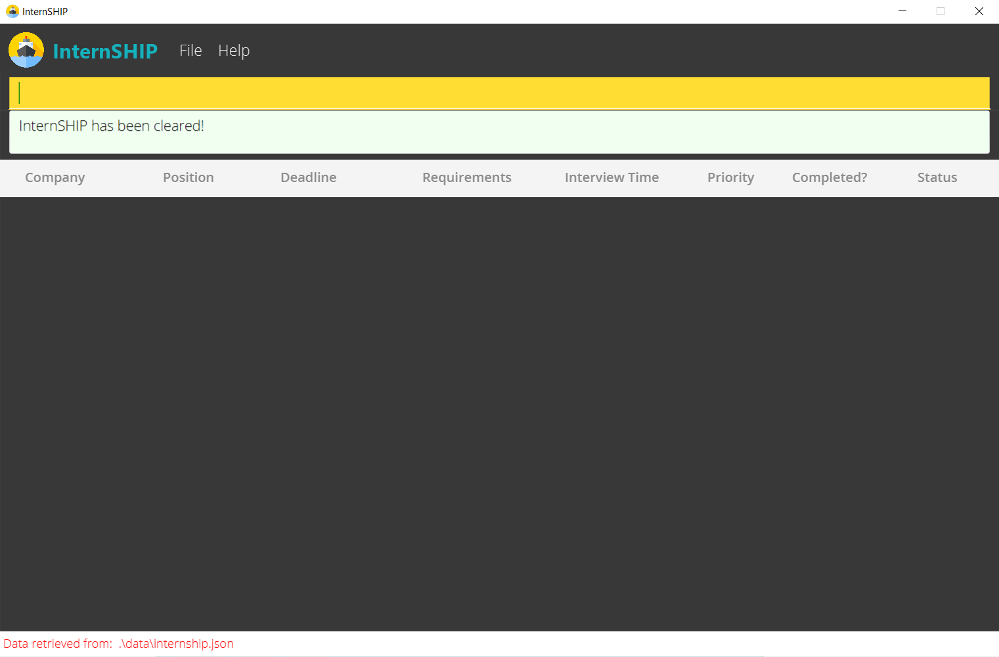
> After the command `clear`

#### Undoing a change: `undo`

Undoes a change made to the application list. 

 :warning: **Warning:** This command is to be used after a command that actually **does some change** to the application list. Inappropriate use may result in unexpected behaviors. 

 :information_source: **Info:**  
Commands that actually 'does some changes' to the application list (thus can be undone):  
- `add`  
- `delete`  
- `edit`  
- `clear`  
Commands that make no change to the application list (thus is not supposed not be followed by `undo` command)  
- `list` 
- `find`  
- `sort`  
- `soon`  

 :warning: **Warning:** When successive changes are made, the `undo` command will undo the **most recent** change.

Successive `undo` commands will undo the previous changes from the most recent to the oldest, until there's no changes
to be restored.

Format: `undo`

Examples:
* `delete 1` followed by `undo` undoes the deletion of the first entry. As a result, that entry will reappear
in the application list.
* `edit 1 p/tester` followed  by `undo` undoes the edition of the first entry's position field. 
As a result, the `position` field of that entry will be restored to its previous value.

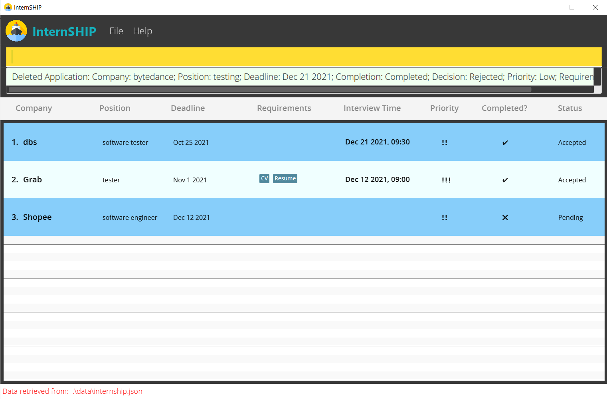
> Before the command `undo` (application at index 1 is deleted)

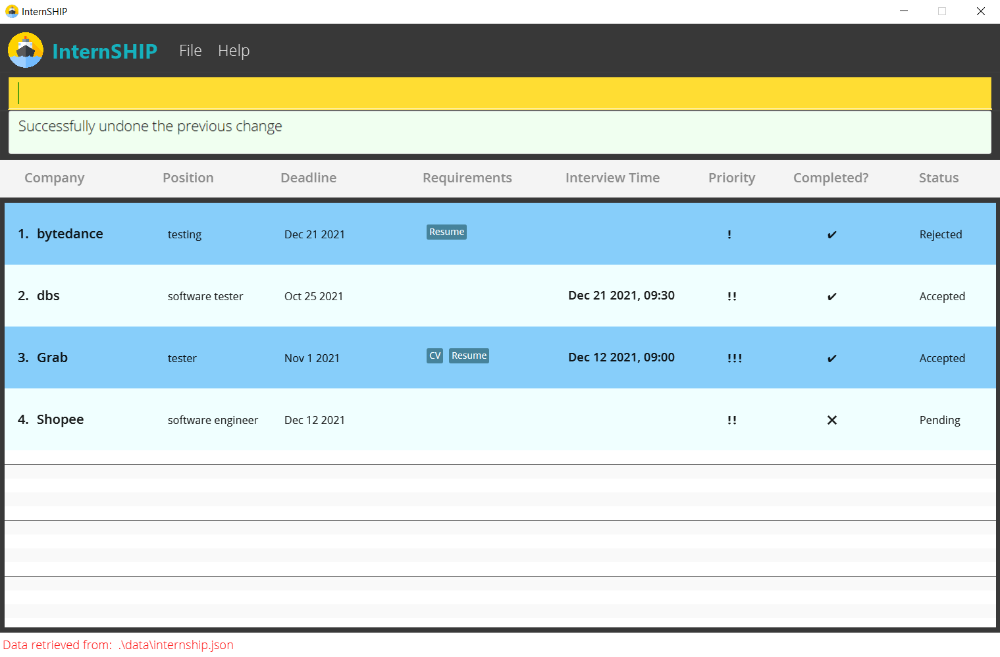
> After the command `undo` (application at index 1 is added back to the list)

#### Redoing a change : `redo`

Redoes a change made to the application list.

 :warning: **Warning:** This command is to be used **directly after** an `undo` command.
If an `undo` command undoes a change (e.g., `delete 1` followed by `undo` restores the first entry), 
and it is followed by a command that makes some new changes to the application list (e.g., `edit 2 pr/High` changes
the priority of the second entry to 'High'), then the previous undone action cannot be redone (i.e., the `delete 1`
command which is previously undone cannot be redone).

 :warning: **Warning:** When successive undone actions are made, the `redo` command will redo the **most recent** undone action.  
Successive `redo` commands will redo the undone actions from the most recent to the oldest, until there's no undone
actions to be redone.

Format: `redo`

Examples:
* `delete 1` followed by `undo` and then `redo` undoes the deletion of the first entry. As a result, that entry will reappear in the application list.
* `edit 1 p/tester` followed by `undo` and then `redo` undoes the edition of the first entry's position field.

> Before the command `redo` (deletion of the first application was undone)

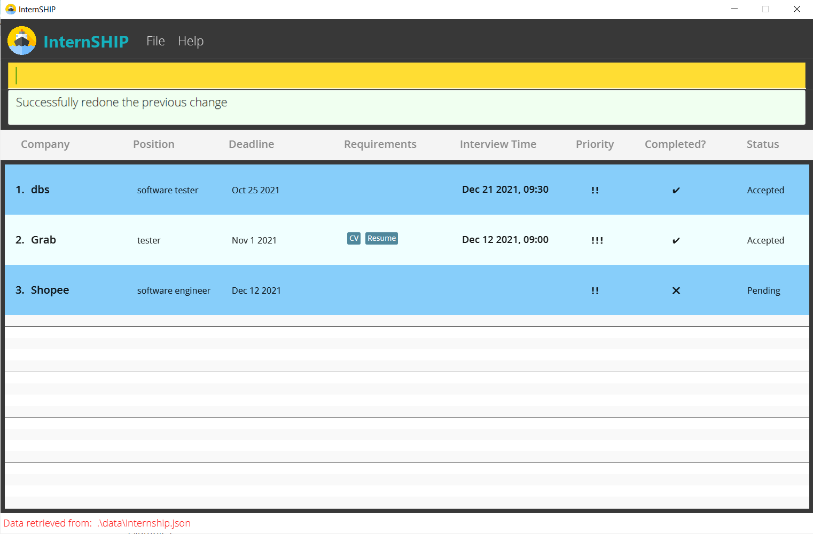
> After the command `redo` (the first application was deleted once again)
 

#### Exiting the program : `exit`

Exits the InternSHIP app.

Format: `exit`

#### Viewing help : `help`

Shows a message directing the user to the [Command Summary](#command-summary) section of the help page.

Format: `help`

--------------------------------------------------------------------------------------------------------------------

## FAQ

**Q**: How do I transfer my data to another Computer? 
**A**: Install the app in the other computer and overwrite the empty data file it creates 
with the file that contains the data of your previous InterSHIP app home folder.

**Q**: How can I save my data in the app? 
**A**: InternSHIP data is saved in the hard disk automatically after any command changes the data. 
There is no need to save manually.

--------------------------------------------------------------------------------------------------------------------

## Tips :bulb:

* Commands that change the displayed list in InternSHIP (e.g. `find`, `sort`) can be used in conjunction with commands that take in `INDEX` as a parameter (e.g. `delete`, `complete`) so that you can work faster!
  * e.g. `find c/Grab` followed by `complete 1` can help you quickly find the application you made to Grab and mark it as completed, instead of slowly searching through your entire list of applications!

* Commands that change the displayed list in InternsHIP (e.g. `find`, `sort`) can also be used in conjunction with each other!
  * e.g. `find c/Grab` followed by `sort pr/` shows all the applications you made to Grab, sorted from higher to lower priority!

--------------------------------------------------------------------------------------------------------------------

## Command summary

This section gives an overview of all the commands supported by InternSHIP.

### Tracking application details

Action | Format | Example | Notes
--------|-------|----|----
**Add** | `add c/COMPANY_NAME p/INTERNSHIP_POSITION d/APPLICATION_DEADLINE [r/APPLICATION_REQUIREMENTS] [i/INTERVIEW_DATE_AND_TIME]` | `add c/Shopee p/software engineer d/2021-12-12` |
**Edit** | `edit INDEX [c/COMPANY_NAME] [p/INTERNSHIP_POSITION] [d/APPLICATION_DEADLINE] [pr/APPLICATION_PRIORITY] [r/APPLICATION_REQUIREMENTS] [i/INTERVIEW_DATE_AND_TIME]` | `edit 1 c/Grab d/2021-12-20`
**Complete** | `complete INDEX` | `complete 1` |
**Accept** | `accept INDEX` | `accept 2` | `APPLICATION_OUTCOME` can only be either `Accepted`, `Rejected`, or `Pending`.
**Reject** | `reject INDEX` | `reject 2` | `APPLICATION_OUTCOME` can only be either `Accepted`, `Rejected`, or `Pending`.

### Viewing specific applications

Action | Format | Example | Notes
--------|-------|----|----
**Find** | `find PREFIX KEYWORD` |  `find pr/High` | `PREFIX` refers to the field to match the keyword (`c/` COMPANY_NAME, `p/` INTERNSHIP_POSITION, `c1/` COMPLETION_STATUS, `s/` APPLICATION_OUTCOME (i.e. STATUS), `pr/` APPLICATION_PRIORITY, `r/` APPLICATION_REQUIREMENTS)
**Soon** | `soon PREFIX DAYS`| `soon d/5` | `PREFIX` refers to the field with coming deadline or time (`d/` APPLICATION_DEADLINE, `i/` INTERVIEW_DATE_AND_TIME)
**List** | `list`| `list` | No parameter required.
**Sort** | `sort PREFIX` | `sort c/` | `PREFIX` refers to the application detail to be sorted by (`c/` COMPANY_NAME, `p/` INTERNSHIP_POSITION, `d/` APPLICATION_DEADLINE, `pr/` APPLICATION_PRIORITY, `i/` INTERVIEW_DATE_AND_TIME)

### Others

Action | Format | Example | Notes
--------|-------|----|----
**Delete** | `delete INDEX` | `delete 3` |
**Clear** | `clear` | `clear` | No parameter required.
**Undo** | `undo`  | `undo` | No parameter required.
**Redo** | `redo` | `redo` | No parameter required.
**Exit** | `exit` | `exit`  | No parameter required.
**Help** | `help` | `help` | No parameter required.

--------------------------------------------------------------------------------------------------------------------

## Prefix summary

This section provides a summary of all the fields and their corresponding prefixes as used in InternSHIP commands.

Field | Prefix | Used in
--------|-------|----
APPLICATION_DEADLINE | **d/** | `add`, `edit`, `sort`, `soon`
APPLICATION_PRIORITY | **pr/** | `edit`, `find`, `sort`
APPLICATION_REQUIREMENTS | **r/** | `add`, `edit`
APPLICATION_OUTCOME (i.e. STATUS) | **s/** | `find`
COMPANY_NAME | **c/** | `add`, `edit`, `find`, `sort`
COMPLETION_STATUS | **c1/** | `find`
INTERNSHIP_POSITION | **p/** | `add`, `edit`, `find`, `sort`
INTERVIEW_DATE_AND_TIME | **i/** | `add`, `edit`, `sort`, `soon`

 :warning: **Warning:** Please ensure you have enter the prefix correctly! 
The list above is a **complete list of all available prefixes** in InternSHIP commands. Any other prefixes that are not listed above are considered as **invalid**, 
which may be interpreted incorrectly as part of the field value and lead to unexpected error messages.

--------------------------------------------------------------------------------------------------------------------

## Glossary

This section explains some terms used in this User Guide.

Term | Definition | Notes
--------|-------|----
**Command Line Interface (CLI)** | Allows users to type in their commands to use an application instead of clicking on buttons on the screen.
**Graphical User Interface (GUI)** | The display of an application with text formatting, background colours, etc... An application without any GUI would only show plain text to the user.
**Java** | A software that allows certain applications (like InternSHIP) to run on the computer. | You will not be able to run InternSHIP on your computer without Java!
**application** | The application for an internship at a specific company.
**field** | The detail of an application. | e.g. company name, internship position, etc...
**command** | The instruction typed by the user for InternSHIP to execute.
**parameter** | A part of the command that consists of information input by the user. | In the context of InternSHIP, this information refers to the actual data of the application fields.
**prefix** | An abbreviation for the application field. For commands like `add` or `edit`, the prefix should be typed in right before the parameter for that field. | Always ends with a slash (/).
**alphanumeric** | A character that is either a letter or a number.

--------------------------------------------------------------------------------------------------------------------

## Acknowledgements

* This project is based on the AddressBook-Level3 project created by the [SE-EDU initiative](https://se-education.org).
* The formatting and content of this User Guide is referenced from [AY2021S2-CS2103T-T11-2/tp](https://github.com/AY2021S2-CS2103T-T11-2/tp/blob/master/docs/UserGuide.md)
* The ship in the InternSHIP icon was obtained from [flaticon.com](https://www.flaticon.com/free-icon/ship_4012401?term=ship&page=1&position=66&page=1&position=66&related_id=4012401&origin=search)
* [Canva](https://www.canva.com) was used to make the InternSHIP icon.
* Libraries used:
    - [JavaFX](https://openjfx.io/)
    - [Jackson](https://github.com/FasterXML/jackson)
    - [JUnit5](https://github.com/junit-team/junit5)
    - [TestFX](https://github.com/TestFX/TestFX)
